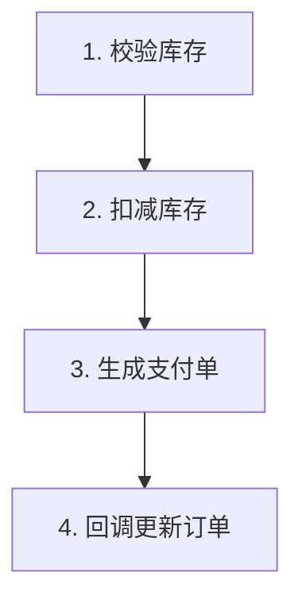

# 流程图防偏离增强 实现计划

> **面向 AI 代理的工作者：** 必需子技能：使用 superpowers:subagent-driven-development（推荐）或 superpowers:executing-plans 逐任务实现此计划。步骤使用复选框（`- [ ]`）语法来跟踪进度。

**目标：** 为 `solve-skill` 增加多步骤任务的业务流程图契约与节点对照机制，降低执行偏离、跳步和漏步。

**架构：** 保持 `solve-skill` 现有主流程不变，在“判断任务状态”之后增加多步骤任务分流。多步骤执行任务先生成并确认 `docs/skill/flows/YYYY-MM-DD-<topic>-flow.md`，执行中每完成节点都输出对照块并回写流程文件。简单任务继续走原流程。

**技术栈：** Markdown skill 文档、Mermaid flowchart、PowerShell、ripgrep。

---

## 文件结构

- 修改：`skills/solve-skill/SKILL.md`
  - 在“核心原则”中增加业务流程图契约原则。
  - 在“交互规则（硬性）”后增加流程图确认、图外动作询问和节点阻塞规则。
  - 在“通用处理流程”中插入多步骤任务分流。
  - 在“测试计划规则”中说明复用流程图依赖关系。
  - 在“状态判断规则”后增加触发判定。
- 创建：`docs/skill/flows/.gitkeep`
  - 让 `docs/skill/flows/` 目录被版本控制跟踪；具体流程图文件由运行时按任务创建。

---

### 任务 1：建立流程图目录

**文件：**
- 创建：`docs/skill/flows/.gitkeep`

- [ ] **步骤 1：编写失败的目录验证**

运行：

```powershell
Test-Path docs\skill\flows\.gitkeep
```

预期：输出 `False`。

- [ ] **步骤 2：创建目录占位文件**

创建文件：

```text
docs/skill/flows/.gitkeep
```

文件内容保持为空。该文件只负责让 Git 跟踪目录，运行时流程图仍按 `docs/skill/flows/YYYY-MM-DD-<topic>-flow.md` 生成。

- [ ] **步骤 3：运行目录验证**

运行：

```powershell
Test-Path docs\skill\flows\.gitkeep
```

预期：输出 `True`。

- [ ] **步骤 4：Commit**

```bash
git add docs/skill/flows/.gitkeep
git commit -m "chore: track skill flow directory"
```

---

### 任务 2：增加核心原则与多步骤分流

**文件：**
- 修改：`skills/solve-skill/SKILL.md:49`

- [ ] **步骤 1：编写失败的内容验证**

运行：

```powershell
rg -n "业务流程图是多步骤执行任务的契约|多步骤任务分流" skills\solve-skill\SKILL.md
```

预期：无匹配，命令退出码为 `1`。

- [ ] **步骤 2：在“核心原则”中追加第 4 条原则**

在 `## 3. 信息不足时，区分"必须询问"和"可以假设"` 区块结束后的 `---` 之前插入：

```markdown
---

## 4. 业务流程图是多步骤执行任务的契约

当任务进入执行实现阶段，且满足多步骤触发条件时，AI 必须先创建业务流程图文件并请用户确认。用户确认后的流程图就是执行契约。

执行中不得默默扩大范围、跳过节点或改变节点顺序。每完成一个节点，AI 必须读取当前流程图文件，对照契约输出节点对照块，并同步回写文件状态。

简单任务、单文件小修改、纯问答不触发流程图。用户明确说“不用画图直接做”时跳过；用户要求简单任务也画图时照做。
```

- [ ] **步骤 3：替换“通用处理流程”代码块**

将 `# 通用处理流程` 下的 `text` 代码块替换为：

```text
1. 读取项目上下文（docs/skill/project-context.md）
2. 理解用户请求
3. 判断任务状态
4. 判断是否为多步骤执行任务
   ├─ 简单任务或用户明确跳过流程图 → 走原流程
   └─ 多步骤执行任务 → 进入业务流程图环节
5. 信息不足 → 做假设，只问最关键的 1 个问题
6. 目标明确 → 给方案或直接执行
7. 执行后 → 验证结果
8. 失败 → 诊断问题
9. 修复 → 重新验证
10. 完成 → 总结沉淀
```

- [ ] **步骤 4：运行内容验证**

运行：

```powershell
rg -n "业务流程图是多步骤执行任务的契约|判断是否为多步骤执行任务|进入业务流程图环节" skills\solve-skill\SKILL.md
```

预期：输出 3 条匹配，均来自 `skills/solve-skill/SKILL.md`。

- [ ] **步骤 5：Commit**

```bash
git add skills/solve-skill/SKILL.md
git commit -m "feat: add flowchart branch to solve skill"
```

---

### 任务 3：定义流程图文件格式与确认门槛

**文件：**
- 修改：`skills/solve-skill/SKILL.md:132`

- [ ] **步骤 1：编写失败的内容验证**

运行：

```powershell
rg -n "流程图文件结构|拆解质量门槛|docs/skill/flows/YYYY-MM-DD-<topic>-flow.md" skills\solve-skill\SKILL.md
```

预期：无匹配，命令退出码为 `1`。

- [ ] **步骤 2：在“输出要求”后新增流程图文件规则**

在 `## 输出要求` 区块结束后的 `---` 之前插入：

`````markdown
---

# 业务流程图环节

## 触发判定

进入执行实现阶段前，AI 必须按以下规则分流：

```text
是多步骤执行任务吗？
  ├─ 涉及 3 个或更多有先后关系的步骤 → 画图
  ├─ 跨多个模块或文件且有业务流转 → 画图
  └─ 单步、单文件、纯问答、小修改 → 走原流程
```

用户说“不用画图直接做”时跳过流程图。用户对简单任务说“画个图”时必须画图。

## 流程图文件结构

多步骤执行任务必须创建流程图文件：

```text
docs/skill/flows/YYYY-MM-DD-<topic>-flow.md
```

文件必须包含三个区块：

1. Mermaid 图：业务层节点，面向用户确认。
2. 节点清单：业务节点、技术子步骤、状态。
3. 变更日志：记录图外动作、图修改、阻塞决策和用户确认结果。

流程图文件模板必须使用四反引号包住内部 Mermaid 代码块：

````markdown
# 库存扣减支付回调 业务流程图

## Mermaid 图



## 节点清单

| # | 业务节点 | 技术子步骤 | 状态 |
|---|---------|-----------|------|
| 1 | 校验库存 | InventoryService.check() + 缓存读取 | ⬜ 未开始 |
| 2 | 扣减库存 | InventoryService.deduct() + 乐观锁 | ⬜ 未开始 |
| 3 | 生成支付单 | PaymentService.create() | ⬜ 未开始 |
| 4 | 回调更新订单 | /callback 接口 + 订单状态机 | ⬜ 未开始 |

## 变更日志

- 初始流程图已生成，等待用户确认。
````

状态必须双写：表格状态列使用 `⬜ 未开始`、`▶ 进行中`、`✓ 完成`、`🟥 阻塞`；Mermaid 使用 `class N1 done`、`class N2 doing`、`class N3 blocked` 表示状态。

## 拆解质量门槛

用户确认流程图之前，AI 必须自检：

1. 业务闭环完整，包含主要成功路径、异常分支、回滚或边界。
2. 每个业务节点都有明确技术子步骤。
3. 节点之间的依赖和先后关系已经画清楚。
4. 所有模糊点已用合理假设消解，并在确认图时交给用户校正。

未通过以上检查，不进入用户确认环节。
`````

- [ ] **步骤 3：运行内容验证**

运行：

```powershell
rg -n "流程图文件结构|拆解质量门槛|docs/skill/flows/YYYY-MM-DD-<topic>-flow.md|状态必须双写" skills\solve-skill\SKILL.md
```

预期：输出 4 条匹配，均来自新增的“业务流程图环节”。

- [ ] **步骤 4：Commit**

```bash
git add skills/solve-skill/SKILL.md
git commit -m "feat: define skill flow document contract"
```

---

### 任务 4：增加节点对照协议与异常分支

**文件：**
- 修改：`skills/solve-skill/SKILL.md:132`

- [ ] **步骤 1：编写失败的内容验证**

运行：

```powershell
rg -n "节点对照块协议|图外动作：无|发现图本身错了|每次对照块之后" skills\solve-skill\SKILL.md
```

预期：无匹配，命令退出码为 `1`。

- [ ] **步骤 2：在“业务流程图环节”中追加节点对照协议**

在“## 拆解质量门槛”区块之后插入：

````markdown
## 节点对照块协议

进入执行后，每完成一个节点，AI 必须输出固定格式的对照块。不输出对照块就是违反本 skill。

```text
🔲 节点对照 [2/4] 扣减库存
  做了什么：InventoryService.deduct() 实现扣减 + 乐观锁重试
  符合图吗：✓ 符合
  图外动作：无
  下一节点：[3/4] 生成支付单
```

四行含义：

| 行 | 作用 |
|----|------|
| 做了什么 | 显式陈述实际产出 |
| 符合图吗 | 将实际产出和已确认流程图对照 |
| 图外动作 | 暴露流程图未覆盖的新增动作 |
| 下一节点 | 锚定下一步，避免跳步或漏步 |

## 异常分支

1. 检测到图外动作：`图外动作` 行不是 `无` 时，AI 必须立即停止执行，用当前环境可用的提问机制询问用户是把该动作加进图里，还是撤销该动作。用户决定后，AI 更新流程图文件并在变更日志记录决策。
2. 节点被阻塞：依赖项失败或前置条件未满足时，AI 必须标记 `🟥 阻塞`，记录阻塞原因，不得跳过该节点继续执行后续节点。
3. 发现图本身错了：执行中发现节点设计错误时，AI 必须停止并回到用户确认环节修改图，不得按错误图继续执行。

## 文件回写规则

每次对照块之后，AI 必须同步回写流程图文件：

1. 更新节点清单的状态列。
2. 更新 Mermaid 节点的 `class` 状态。
3. 如有图外动作、阻塞或图修改，在变更日志追加一条记录。
4. 回写完成后再进入下一节点。

## 对照红旗

| 念头 | 必须执行的规则 |
|------|----------------|
| “这步很小” | 小节点也要输出对照块 |
| “我记得图” | 必须读取流程图文件确认当前状态 |
| “顺手多改一个点” | 这是图外动作，必须停下询问用户 |
````

- [ ] **步骤 3：运行内容验证**

运行：

```powershell
rg -n "节点对照块协议|图外动作：无|发现图本身错了|每次对照块之后|必须读取流程图文件确认当前状态" skills\solve-skill\SKILL.md
```

预期：输出 5 条匹配，均来自新增协议。

- [ ] **步骤 4：Commit**

```bash
git add skills/solve-skill/SKILL.md
git commit -m "feat: add node alignment protocol"
```

---

### 任务 5：衔接提问机制、假设优先与测试依赖分析

**文件：**
- 修改：`skills/solve-skill/SKILL.md:87`
- 修改：`skills/solve-skill/SKILL.md:169`

- [ ] **步骤 1：编写失败的内容验证**

运行：

```powershell
rg -n "流程图确认和图外动作询问|流程图确认后，假设优先降级|验证测试阶段优先复用流程图" skills\solve-skill\SKILL.md
```

预期：无匹配，命令退出码为 `1`。

- [ ] **步骤 2：在提问规则中加入流程图询问场景**

在 `## 必须使用当前环境可用的提问机制` 的“必须的行为”列表之后插入：

```markdown

流程图确认和图外动作询问也必须使用当前环境可用的提问机制：
- 确认流程图：提供“确认并开始执行”“修改流程图”“跳过流程图直接执行”等选项。
- 图外动作：提供“加入流程图并继续”“撤销图外动作”“暂停执行”等选项。
- 提问后立即停止，等待用户选择。
```

- [ ] **步骤 3：在假设优先规则中加入执行阶段边界**

在 `## 假设优先` 区块末尾插入：

```markdown

流程图确认后，假设优先降级：执行阶段发现图外动作、节点阻塞或流程图错误时，不得用假设继续推进，必须按节点对照协议停止并处理。
```

- [ ] **步骤 4：在测试计划规则中加入流程图复用**

在 `## 依赖分析优先` 第一段后插入：

```markdown

如果当前任务存在已确认的业务流程图，验证测试阶段优先复用流程图中的节点依赖关系生成测试顺序，不重复发明另一套依赖分析。
```

- [ ] **步骤 5：运行内容验证**

运行：

```powershell
rg -n "流程图确认和图外动作询问|流程图确认后，假设优先降级|验证测试阶段优先复用流程图" skills\solve-skill\SKILL.md
```

预期：输出 3 条匹配。

- [ ] **步骤 6：Commit**

```bash
git add skills/solve-skill/SKILL.md
git commit -m "feat: connect flow protocol to existing solve rules"
```

---

### 任务 6：最终验证与规格覆盖检查

**文件：**
- 验证：`skills/solve-skill/SKILL.md`
- 验证：`docs/skill/flows/.gitkeep`
- 参考：`docs/superpowers/specs/2026-06-05-flowchart-anti-drift-design.md`

- [ ] **步骤 1：运行关键需求覆盖验证**

运行：

```powershell
rg -n "多步骤执行任务|业务流程图环节|流程图文件结构|拆解质量门槛|节点对照块协议|异常分支|文件回写规则|验证测试阶段优先复用流程图" skills\solve-skill\SKILL.md
```

预期：至少输出 8 条匹配，覆盖触发、文件、门槛、对照、异常、回写、测试复用。

- [ ] **步骤 2：运行简单任务不触发验证**

运行：

```powershell
rg -n "简单任务、单文件小修改、纯问答不触发流程图|单步、单文件、纯问答、小修改" skills\solve-skill\SKILL.md
```

预期：输出 2 条匹配。

- [ ] **步骤 3：运行目录验证**

运行：

```powershell
Test-Path docs\skill\flows\.gitkeep
```

预期：输出 `True`。

- [ ] **步骤 4：检查工作区 diff**

运行：

```bash
git diff -- skills/solve-skill/SKILL.md docs/skill/flows/.gitkeep
```

预期：
- `skills/solve-skill/SKILL.md` 只新增业务流程图、防偏离、对照协议相关内容。
- `docs/skill/flows/.gitkeep` 是空文件。
- `docs/skill/project-context.md` 没有变化。

- [ ] **步骤 5：规格覆盖自检**

逐项确认：

```text
背景目标：任务 2、任务 4 覆盖
整体架构：任务 2 覆盖
流程图文件结构：任务 1、任务 3 覆盖
节点对照块协议：任务 4 覆盖
触发判定：任务 2、任务 3 覆盖
拆解质量门槛：任务 3 覆盖
与现有规则衔接：任务 5 覆盖
成功标准：任务 6 覆盖
影响范围：任务 1 至任务 5 覆盖
```

- [ ] **步骤 6：Commit**

如步骤 1-5 发现措辞缺口，先修正文档并重新运行对应验证。全部通过后运行：

```bash
git add skills/solve-skill/SKILL.md docs/skill/flows/.gitkeep
git commit -m "test: verify flowchart anti drift skill rules"
```
