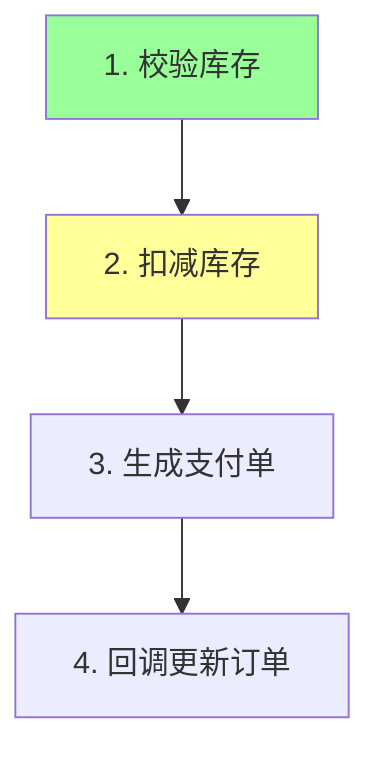

# 流程图防偏离增强 · 设计规格

> 日期：2026-06-05
> 主题：为 solve-skill 增加"业务流程图"环节，让 AI 在实现多步骤需求时不偏离目标
> 状态：设计已确认，待用户审查

---

## 1. 背景与目标

### 问题

现有 `solve-skill` 规则偏软（"假设优先""先做再问"），在多步骤任务中 AI 容易在执行中途偏离原始目标、私自扩大范围、跳步或漏步。用户判断：obra/superpowers 那种"大而全"的全流程框架不需要，只需要一个聚焦的机制——**让 AI 在实现需求时不偏离目标**。

### 核心洞察

光画流程图**不能**防偏离。真正防偏离的是两件事：

1. **图经用户确认后变成"契约"**——有共识基线，才谈得上"偏离"；
2. **执行中每完成一个节点，AI 主动对照这张图自查**——没人回头看的图等于没画。

因此本设计的重点是"**图 + 强制对照机制**"，而非单纯"出图"。

### 目标（四合一）

同一张业务流程图，贯穿任务始终，承担四个作用：

| 作用 | 说明 |
|------|------|
| 需求拆解 | 把大而模糊的需求拆成清晰的业务+技术节点 |
| 沟通对齐 | 用户确认无误后再开工（图 = 契约） |
| 防偏离锚点 | 执行中每节点对照图，偏离即停 |
| 进度跟踪 | 节点状态实时回写文件，可视化进展 |

### 非目标

- 不重写 solve-skill 主体，只**增强**（新增一个环节）。
- 不对单步/简单任务画图。
- 不引入浏览器渲染、不引入外部依赖。

---

## 2. 整体架构

在 `solve-skill` 现有流程的"判断任务状态"之后插入一道分流，不改动主体结构。

```
读项目上下文 → 判断任务状态
                   │
                   ├─ 单步/简单任务 ─────────────→ 走原流程（不画图）
                   │
                   └─ 多步骤任务 ──→ 【新环节：业务流程图】
                                       1. 拆解为业务+技术两层节点
                                       2. 生成 Mermaid 图 → 写入 .md 文件
                                       3. 用户确认（图 = 契约）
                                       4. 执行：每完成一节点 → 对照块 + 回写文件
                                       5. 全部节点 ✓ → 进入验证（原流程）
```

**新增产物**：每个多步骤任务生成一个流程图文件：

```
docs/skill/flows/YYYY-MM-DD-<topic>-flow.md
```

与现有 `docs/skill/` 同根，符合 solve-skill 读上下文的习惯。

**定位**：这是"增强"不是"重写"。现有的状态判断表、假设优先、提问规则、测试依赖分析全部保留。流程图环节只在"多步骤任务"分支被激活。

---

## 3. 流程图文件结构

文件 `docs/skill/flows/YYYY-MM-DD-<topic>-flow.md` 含三个区块。

### 区块 1 — Mermaid 图（业务层为主，给用户看）



状态靠 `classDef` 上色：`done` 绿、`doing` 黄、`blocked` 红、未开始默认色。

### 区块 2 — 节点清单（业务+技术两层，AI 对照用）

| # | 业务节点 | 技术子步骤 | 状态 |
|---|---------|-----------|------|
| 1 | 校验库存 | InventoryService.check() + 缓存读取 | ✓ 完成 |
| 2 | 扣减库存 | deduct() + 乐观锁 | ▶ 进行中 |
| 3 | 生成支付单 | PaymentService.create() | ⬜ 未开始 |
| 4 | 回调更新订单 | /callback 接口 + 状态机 | ⬜ 未开始 |

- **业务节点** = Mermaid 图的方框（用户视角，看流程对不对）。
- **技术子步骤** = 表格里挂在业务节点下（AI 视角，对照做没做）。
- 两层合一张表，不另开文件。

### 区块 3 — 变更日志（记录偏离与决策）

```
- [节点2] 原计划用悲观锁，改乐观锁。原因：读多写少。已告知用户。
```

任何图外动作、任何对图的修改，必须在此留一笔。

**状态双写**：emoji（表格，快速扫）+ Mermaid classDef（图，直观看）保持一致。

---

## 4. 节点对照块协议（防偏离核心 · 硬性）

进入执行后，每完成一个节点，AI **必须**输出一段固定格式的对照块。不输出 = 违规。

### 格式

```
🔲 节点对照 [2/4] 扣减库存
  做了什么：InventoryService.deduct() 实现扣减 + 乐观锁重试
  符合图吗：✓ 符合
  图外动作：无
  下一节点：[3/4] 生成支付单
```

### 四行各自的作用（每行都是一道闸）

| 行 | 防的是什么 |
|----|-----------|
| 做了什么 | 逼 AI 显式陈述实际产出，不能含糊带过 |
| 符合图吗 | 逼 AI 把产出和契约比对，不能默认"应该对" |
| 图外动作 | **最关键**——逼 AI 主动暴露"我做了图上没有的事" |
| 下一节点 | 锚定下一步，防止跳步或漏步 |

### 三种异常分支

1. **检测到图外动作**（"图外动作"行非"无"）
   → 立即停下，用当前环境可用的提问机制问用户：该图外动作是加进图里，还是不该做、要撤掉？用户决定后更新图 + 记变更日志。**不允许 AI 自己默默扩大范围。**

2. **节点被阻塞**（依赖项失败/前置未满足）
   → 标记 `🟥 阻塞`，记录阻塞原因（哪个节点导致），不跳过它去做后面的节点。

3. **发现图本身错了**（执行中才发现某节点设计有问题）
   → 停下报告，回到"用户确认"环节改图，而非将错就错继续。

### 文件回写

每次对照块之后，同步回写 `.md` 文件：更新表格状态列 + Mermaid classDef 上色。文件始终是当前进度的真实快照——跨上下文不丢进度。

### 红旗自查（防 AI 给自己找借口跳过对照）

| 念头 | 现实 |
|------|------|
| "这步很小，不用对照" | 小步也要对照块，否则协议形同虚设 |
| "我记得图，不用读文件" | 上下文会丢，必须读文件确认状态 |
| "顺手把这个也改了" | 这就是图外动作，必须停下问用户 |

---

## 5. 触发判定

进入执行前按此判据分流：

```
是多步骤任务吗？
  ├─ 涉及 ≥3 个有先后/依赖关系的步骤   → 画图
  ├─ 跨多个模块/文件且有业务流转       → 画图
  └─ 单步、单文件、纯问答、小修改        → 不画图，走原流程
```

**逃生口**：用户说"不用画图直接做"则跳过；用户对简单任务说"画个图"则照画。AI 判断 + 用户可推翻。

---

## 6. 拆解质量门槛（硬性）

> 设计阶段必须把需求节点拆分充分完整，否则执行阶段会返工。

这是本设计的一条硬性原则。画图（设计阶段）时：

- 节点必须覆盖需求的**完整业务闭环**，不能只拆一半就开工。
- 每个业务节点必须能填出对应的技术子步骤；填不出 = 拆解不到位，继续拆。
- 节点之间的**依赖/先后关系**必须在图里画清楚（直接复用于后续测试顺序）。
- 存在模糊处，在拆解阶段用"假设优先"先填、再让用户在确认图时一并校正——**绝不把模糊留到执行阶段**。

**门槛检查**（用户确认图之前，AI 自检）：

1. 业务闭环完整吗？有没有漏掉的环节（如异常分支、回滚、边界）？
2. 每个节点的技术子步骤都填了吗？
3. 依赖关系画清楚了吗？
4. 还有没有"待定/看情况"的模糊节点？有就先消解。

未通过门槛，不进入"用户确认图"环节。

---

## 7. 与现有规则的衔接

| 现有规则 | 衔接方式 |
|---------|---------|
| 读 `project-context.md` | 不变。画图前仍先读，让技术子步骤符合项目技术栈 |
| 8 种状态判断 | 不变。流程图只在判定为"多步骤的执行实现"时激活 |
| 假设优先 / 先做再问 | **降级**：仅在画图前的拆解阶段适用。一旦图被确认进入执行，"图外动作必停"优先级更高——不能再用"假设优先"当借口默默扩范围 |
| 提问硬规则 | 复用。"确认图""图外动作询问"都走当前环境可用的结构化提问工具；若运行时没有结构化提问工具，则输出固定文本选项并停止等待 |
| 测试计划的依赖分析 | 复用同一张图：节点依赖关系直接拿来排测试顺序，不重复分析 |

**关键张力的处理**：现有 skill 强调"不要频繁打断"，新协议强调"每节点对照、图外动作必停"。划界——**拆解阶段保留假设优先（不啰嗦），执行阶段对照块优先（防偏离）**。

---

## 8. 成功标准

- 多步骤任务开工前，存在一个用户已确认的流程图文件。
- 执行过程中，每个节点完成都有对照块输出，且文件状态被更新。
- 出现图外动作时，AI 停下询问而非默默扩范围（可在变更日志中追溯每一次偏离与决策）。
- 简单任务不触发画图，无额外负担。
- 现有 solve-skill 的其余行为不受影响。

---

## 9. 影响范围

- **修改**：`skills/solve-skill/SKILL.md`——新增"业务流程图"环节及对照协议章节。
- **新增**：`docs/skill/flows/` 目录（运行时由 AI 按任务生成流程图文件）。
- **不动**：`docs/skill/project-context.md` 结构、现有状态判断与测试规则。
