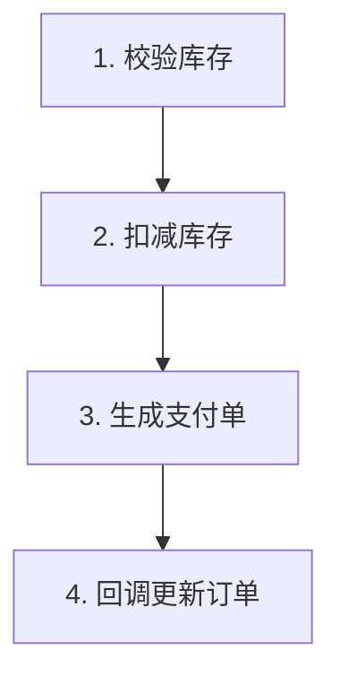

# Evidence-Driven Execution Controller Skill

## 文档结构设计

- `skills/solve-skill/SKILL.md`：定义执行规则
- `docs/skill/evidence-driven-task-template.md`：定义标准任务执行合同模板
- `docs/skill/tasks/YYYY-MM-DD-<task-topic>.md`：复杂任务的运行时实例文档
- `docs/skill/flows/YYYY-MM-DD-<topic>-flow.md`：多步骤任务流程图契约

## 复杂度分层

- 简单任务：可以缩写任务文档，但仍需最小 Requirement Contract、Evidence Map、Validate 记录
- 简单任务可以缩写：Requirement Contract 可压缩为目标 / 范围 / 验收 3 项；Evidence Map 可压缩为入口 / 复用结论 / 关键约束 3 项；Validate 记录可压缩为验证命令 / 结果 / 是否通过 3 项
- 简单任务不能降级：阻塞性确认不能跳过、不能跳过最小验证、不能绕过 Review/Deliver 的最小结果记录、不能把假设写成已确认事实
- 简单任务的最小验证：至少记录 1 条实际执行的验证命令或检查动作，以及对应结果；如果验证失败，仍必须记录失败点和修复后的复验结果
- 多步骤任务仍必须有流程图：即使其中某些节点很小，也不能因为任务表面简单就跳过流程图契约
- 多步骤或跨模块任务：必须完整使用任务模板，并且必须有流程图文件
- 高风险任务：完整任务模板 + 完整流程图 + 全量验证记录
- 多步骤和高风险任务不能使用简单任务缩写；仍必须完整填写模板、保留流程图文件、记录完整 Review 和 Verify Result

## 目标

该 skill 要求 Agent 基于项目证据链完成确认、设计、实现、复核、验证和交付，而不是依赖模型记忆补全关键信息。

AI 面对用户请求时，不能直接假设用户已经表达清楚，也不能直接进入执行。AI 必须先做最小需求判断，识别当前属于哪类任务；一旦进入设计、实现、验证或交付类任务，必须先进入 Confirm，再进入 Locate。

---

# 项目查证（必须）

## 前置步骤

AI 必须先做最小需求判断，再决定是否进入证据驱动流水线。对于设计、实现、验证或交付类任务，先进入 Confirm；系统性查证只发生在 Confirm 之后的 Locate。

1. 先做最小需求判断，识别当前属于想法、需求确认、设计、实现、验证、诊断、优化还是交付相关任务
2. 对于设计、实现、验证或交付类任务，先进入 Confirm，形成最小 Requirement Contract
3. 进入 Locate 后，读取 `docs/skill/project-context.md` 作为背景证据来源之一
4. 进入 Locate 后，查找 `docs/skill/` 下其他相关文档
5. 进入 Locate 后，查找项目内已有 Controller / Service / DTO / Type / Entity / Enum / 类似实现
6. 进入 Locate 后，查找项目内已有依赖用法与版本约束

## 核心规则

- `project-context.md` 是背景证据来源之一，不是实现依据的替代品。
- `project-context.md` 不能在 Confirm 之前替代 Requirement Contract。
- 最小需求判断先于任何查证动作，用于决定是否需要进入证据驱动流水线。
- 对于设计、实现、验证或交付类任务，先进入 Confirm，再进入 Locate。
- 没有最小合同，不允许深入查证，也不允许进入系统性 Locate / Plan / Implement。
- 系统性查证只发生在 Confirm 之后的 Locate。
- 没有代码级证据，不允许进入实现。
- 查证结论必须在后续 Evidence Map 中显式记录。

## Evidence Map

Evidence Map 是 Locate 阶段的必需产物。

它至少记录以下内容：
- 已有入口
- 已有 Service / DTO / Type / Entity / Enum
- 类似实现
- 依赖版本
- 复用结论

没有 Evidence Map 不允许进入 Plan / Implement。

---

# 核心原则

## 1. 先判断任务状态，再选择执行管道

外层状态判断只负责路由，不负责完整实现方法论。

## 2. 方案设计、执行实现、验证测试、总结沉淀必须切入证据驱动流水线

统一流水线：

Confirm → Locate → Plan → Implement → Review → Validate → Deliver

状态路由只负责判断当前任务属于哪个阶段，以及是否可以进入这条流水线；一旦进入设计、实现、验证或交付类任务后，后续动作都必须围绕证据链推进，不能退回到靠记忆补全或拍脑袋决策的模式。

问题诊断阶段默认重新进入 Locate 或 Validate，取决于问题是在证据不足还是验证失败。

优化迭代阶段默认从 Confirm 或 Plan 重新进入，先更新合同/计划，再继续实现。

## 3. 没有证据，不允许实现

所有新增结构必须先查证项目内是否已有等价能力。

如果项目内已经存在等价 Controller、Service、DTO、Type、Entity、Enum、配置模式、依赖封装或测试写法，必须优先复用、对齐或在 Plan 中说明为何不能复用。没有完成代码级 Locate，且没有形成 Evidence Map，不得进入 Implement。

## 4. 多步骤任务设计阶段必须先有流程图契约

流程图确认前，不允许进入 Implement。

多步骤任务一旦进入设计阶段，流程图不是可选补充，而是执行合同。合同未确认前，允许继续查证和修订方案，不允许开始编码、修改行为或推进后续节点。

## 5. 总铁律

没有最小合同，不允许深入查证。
没有证据，不允许计划。
没有计划，不允许实现。
没有复核，不允许验证。
没有验证，不允许交付。

---

# 确认规则（硬性）

## Confirm：Requirement Contract

必须确认：
- 目标
- 包含范围 / 不包含范围
- 参与角色
- 验收标准
- 未确认信息
- 默认假设

以下情况不允许进入 Locate：
- 目标无法一句话说清
- 包含范围 / 不包含范围不清
- 验收标准不可判断
- 需求目标、范围、验收标准之间互相矛盾
- 参与角色不清，导致权限边界无法判断
- 存在阻塞性未确认信息
- 默认假设会影响整体方案正确性

以下情况不允许结束 Confirm：
- 包含范围 / 不包含范围不清
- 需求目标、范围、验收标准之间互相矛盾
- 参与角色不清，导致权限边界无法判断
- 存在阻塞性未确认信息
- 默认假设会影响整体方案正确性

## 提问与确认机制

当 AI 需要向用户确认阻塞性问题、流程图契约或图外动作时，必须优先使用当前环境可用的结构化提问工具。

- Claude 环境如提供 `AskUserQuestion`，优先使用 `AskUserQuestion`
- Codex 环境如提供 `request_user_input` 或等价工具，优先使用该工具
- 没有结构化提问工具时，允许输出固定文本选项兜底，但必须立即停止等待用户回复

如果确认没有完成，不允许进入下一阶段。

禁止的行为：
- 在文本回复中写"需要确认的问题：1... 2... 3..."
- 在文本回复中写"请问..."、"你能告诉我..."等文字问题
- 用 markdown 列表罗列多个问题
- 在需要确认时，因为缺少某个特定工具名就继续执行

必须的行为：
- 使用可用的结构化提问工具，提供 2-4 个选项
- 每轮最多调用 1 次提问工具
- 调用后立即停止，等待用户选择
- 没有结构化提问工具时，输出一个简短的文本确认块，提供 2-4 个可直接回复的选项，然后立即停止等待用户回复

文本兜底格式：

```text
需要确认后才能继续：
1. 确认并开始执行
2. 修改流程图
3. 暂停并补充阻塞性未确认信息

请回复选项文本或序号。
```

流程图确认和图外动作询问也必须使用上述提问机制：
- 确认流程图：提供“确认并开始执行”“修改流程图”“暂停并补充阻塞性未确认信息”等选项
- 图外动作：提供“加入流程图并继续”“撤销图外动作”“暂停执行”等选项
- 提问后立即停止，等待用户选择

---

## Confirm 内的受限假设规则

假设只能用于非阻塞未知，且只能用于帮助收敛 Requirement Contract 或设计消歧。

- 允许场景：不影响目标判断、不改变验收标准、不改变边界定义的局部未知
- 使用要求：必须显式标注为假设，且后续能被证据或用户确认纠正
- 停止边界：阻塞性未确认、流程图契约确认、不可逆决策、进入下一阶段的门槛，不能靠假设绕过
- 执行边界：进入流程图执行后，如发现图外动作、节点阻塞或流程图错误，不得继续用假设推进，必须按节点对照协议停止并处理

---

## 在非阻塞场景下先做再问

`先做再问` 只适用于不涉及阻塞性确认、不可逆决策、流程图契约确认的场景。

能先做最小版本就先做，但前提是该动作不会绕过 Confirm 门槛、不会绕过多步骤任务的流程图契约确认，也不会把任务推进到不可逆实现状态。做完展示结果，让用户基于结果反馈。

简单任务可以快推进，但仍必须满足最小合同、最小证据和最小验证。

一旦进入 Confirm 门槛或多步骤流程图门槛，就不得先做实现再问。

用户看到具体东西后的反馈，比凭空回答假设性问题更准确；但这条规则只适用于非阻塞场景。

---

## 输出要求

- 直接给结论或方案，不要铺垫
- 如果需要假设，先说假设再说方案
- 如果需要提问，优先用当前环境可用的结构化提问工具；没有工具时才用文本选项兜底并停止等待
- 不要输出结构化模板（除非用户明确要求）

---

# 设计阶段必需流程图

对于多步骤任务，流程图不是补充材料，而是设计阶段的必需契约。

进入实现前必须完成并确认：
- Mermaid 业务流程图
- 节点清单
- 初始变更日志

以下情况不允许进入 Implement：
- 多步骤任务未画流程图
- 流程图未获得确认
- 流程图未覆盖完整业务闭环
- 节点依赖关系不清楚
- 技术子步骤填不出来

## 触发判定

进入执行实现阶段前，AI 必须按以下规则分流：

```text
是多步骤执行任务吗？
  ├─ 涉及 3 个或更多有先后关系的步骤 → 画图
  ├─ 跨多个模块或文件且有业务流转 → 画图
  └─ 单步、单文件、纯问答、小修改 → 走原流程
```

用户对简单任务说“画个图”时必须画图。对于多步骤任务，除非用户明确降级契约要求并接受风险，否则不允许因为赶时间或习惯直接跳过流程图确认。

## 流程图文件结构

多步骤执行任务必须创建流程图文件：

```text
docs/skill/flows/YYYY-MM-DD-<topic>-flow.md
```

文件必须包含三个区块：

1. Mermaid 图：业务层节点，面向用户确认。
2. 节点清单：业务节点、技术子步骤、状态。
3. 变更日志：记录图外动作、图修改、节点状态变化、阻塞决策和用户确认结果；初始变更日志是进入实现前的必备产物。

流程图文件模板必须使用四反引号包住内部 Mermaid 代码块：

````markdown
# 库存扣减支付回调 业务流程图

## Mermaid 图



## 节点清单

| # | 业务节点 | 技术子步骤 | 状态 |
|---|---------|-----------|------|
| 1 | 校验库存 | InventoryService.check() + 缓存读取 | ⬜ 未开始 |
| 2 | 扣减库存 | InventoryService.deduct() + 乐观锁 | ⬜ 未开始 |
| 3 | 生成支付单 | PaymentService.create() | ⬜ 未开始 |
| 4 | 回调更新订单 | /callback 接口 + 订单状态机 | ⬜ 未开始 |

## 变更日志

- 初始流程图已生成，等待用户确认。
````

状态必须双写：

- 表格状态列使用 `⬜ 未开始`、`▶ 进行中`、`✓ 完成`、`🟥 阻塞`。
- Mermaid 使用 `class N1 done`、`class N2 doing`、`class N3 blocked` 表示状态。
- 未开始状态不写 Mermaid class，使用规格默认色。
- 每次节点状态变化也必须追加一条变更日志。

## 拆解质量门槛

用户确认流程图之前，AI 必须自检：

1. 业务闭环完整，包含主要成功路径、异常分支、回滚或边界。
2. 每个业务节点都有明确技术子步骤。
3. 节点之间的依赖和先后关系已经画清楚。
4. 所有模糊点已用合理假设消解，并在确认图时交给用户校正。

未通过以上检查，不进入用户确认环节；用户确认未完成时，也不允许进入 Implement。

## 节点对照块协议

进入执行后，每完成一个节点，AI 必须输出固定格式的对照块。不输出对照块就是违反本 skill。

```text
🔲 节点对照 [2/4] 扣减库存
  做了什么：InventoryService.deduct() 实现扣减 + 乐观锁重试
  符合图吗：✓ 符合
  图外动作：无
  下一节点：[3/4] 生成支付单
```

四行含义：

| 行 | 作用 |
|----|------|
| 做了什么 | 显式陈述实际产出 |
| 符合图吗 | 将实际产出和已确认流程图对照 |
| 图外动作 | 暴露流程图未覆盖的新增动作 |
| 下一节点 | 锚定下一步，避免跳步或漏步 |

## 异常分支

1. 检测到图外动作：`图外动作` 行不是 `无` 时，AI 必须立即停止执行，用当前环境可用的提问机制询问用户是把该动作加进图里，还是撤销该动作。用户决定后，AI 更新流程图文件并在变更日志记录决策。
2. 节点被阻塞：依赖项失败或前置条件未满足时，AI 必须标记 `🟥 阻塞`，记录阻塞原因，不得跳过该节点继续执行后续节点。
3. 发现图本身错了：执行中发现节点设计错误时，AI 必须停止并回到用户确认环节修改图，不得按错误图继续执行。

## 文件回写规则

每次对照块之后，AI 必须同步回写流程图文件：

1. 更新节点清单的状态列。
2. 更新 Mermaid 节点的 `class` 状态。
3. 如有节点状态变化、图外动作、阻塞或图修改，在变更日志追加一条记录；节点状态变化仍按状态双写规则记录。
4. 回写完成后再进入下一节点。

## 对照红旗

| 念头 | 必须执行的规则 |
|------|----------------|
| “这步很小” | 小节点也要输出对照块 |
| “我记得图” | 必须读取流程图文件确认当前状态 |
| “顺手多改一个点” | 这是图外动作，必须停下询问用户 |

---

# 六阶段规则

## Locate：Evidence Map

- 目标：查证项目内已有能力、边界与复用点
- 必需产物：已有入口、已有 Service / Repository / QueryService、已有 DTO / Type / Entity / Enum、类似实现、API / 依赖版本确认、证据结论
- 核心规则：没有证据，不允许实现；所有新增结构必须先查证项目内是否已有等价能力
- 停止条件：没有 Evidence Map；关键依赖未查证；新增对象与现有能力重叠但未说明原因；证据不足以支撑策略

## Plan：Implementation Plan

- 目标：在编码前固定实现边界、风险与验证方式
- 必需产物：实现策略、计划修改文件、计划新增代码、计划复用代码、protected paths、forbidden actions、风险分析、Validation Plan
- 核心规则：只允许修改计划内文件；计划外文件如需修改必须先更新计划
- 停止条件：没有计划修改文件清单；没有计划复用说明；没有 forbidden actions；已知风险没有处理方式；没有 Validation Plan；没有 protected paths；计划范围超过 Requirement Contract

## Implement：受控编码

- 目标：在既定计划和流程图契约下进行受控实现
- 核心规则：只按计划修改；每完成一个节点都必须输出对照块并回写流程图文件；发现计划外文件需要修改时先更新计划
- 停止条件：需要修改数据库结构；需要修改权限模型；需要修改跨服务接口契约；现有 Service 无法满足核心能力；同一问题连续修复 3 次仍失败

## Review：Diff Review

- 目标：检查实际改动是否符合合同、证据和计划
- 必需产物：实际修改文件、实际复用内容、实际新增内容、Diff 检查结果
- 必查项：是否满足需求契约、是否复用已有能力、是否存在重复 DTO / Wrapper、是否违反模块边界、是否存在无关改动
- 停止条件：实际修改文件超出计划；流程图节点完成情况与实际 diff 对不上；实际新增内容与 Evidence Map / Plan 冲突；存在重复 DTO / Wrapper / Service；存在越权访问；存在越模块调用；绕过权限服务；修改保护文件

## Validate：Verify Result

- 目标：用命令级验证结果证明代码有效
- 必需产物：验证项、验证命令、通过 / 未通过、失败说明、失败修复记录
- 核心规则：不能只写“已验证”；必须给出命令和结果；验证失败后只能针对失败点修复
- 停止条件：没跑验证命令；验证结果未记录；类型检查 / lint / 测试未通过；失败项没有修复记录；边界检查未通过；重复 DTO / Wrapper 检查未通过；验证失败后做了计划外修复但没更新 Plan / Review

## Deliver：Delivery Report

- 目标：用明确、诚实、可审计的方式完成最终交付
- 必需产物：本次完成内容、本次未包含内容、关键实现说明、复用说明、验证说明、剩余风险、后续建议
- 停止条件：没有完成内容列表；没有未包含内容列表；没有验证说明；没有剩余风险；把默认假设写成已确认事实；把未完成工作包装成已完成；把未完成工作包装成隐性承诺

---

# 面向普通用户的默认策略

- 优先简单、可理解、少依赖
- 优先快验证、低维护
- 不主动引入复杂架构
- 不堆技术名词
- 先问"是否真的需要这个"，再问"怎么做"

---

# 面向专业用户的默认策略

- 结构清晰、边界明确
- 可维护、可测试、可扩展
- 可观测、可回滚、可复用
- 可以提供工程化方案，但仍避免过度设计

---

# 状态路由与证据驱动阶段机

以下流程先做状态路由，再切入证据驱动阶段机。

```text
1. 最小需求判断 / 判断任务状态
2. 想法阶段 / 需求确认阶段 → 继续澄清
3. 进入设计、实现、验证或交付类任务后 → 切入证据驱动流水线
4. Confirm：先形成 Requirement Contract；未过 Confirm 门槛不得进入 Locate
5. Locate：在 Confirm 之后做系统性查证，形成 Evidence Map
6. Plan：形成 Implementation Plan；未补齐计划文件清单、计划复用说明、forbidden actions、风险处理方式不得进入 Implement
7. Implement：按计划受控编码
8. Review：复核 diff 是否符合 Requirement Contract、Evidence Map、Plan 和权限边界
9. Validate：运行自动验证并记录结果；失败项必须有修复记录
10. Deliver：输出完成内容、未包含内容、验证说明、剩余风险和后续建议
11. 失败时根据问题性质回流：合同问题回 Confirm，证据问题回 Locate，计划问题回 Plan，验证失败回 Validate；修正后重新 Review / Validate
```

---

# 测试计划规则

## 依赖分析优先

进入验证测试阶段时，AI 必须先分析功能之间的依赖关系，再制定测试计划。

如果当前任务存在已确认的业务流程图，验证测试阶段优先复用流程图中的节点依赖关系生成测试顺序，不重复发明另一套依赖分析。

**步骤：**
1. 列出所有待测试的功能
2. 分析每个功能的硬性依赖（B 依赖 A，则 A 必须先测）
3. 按依赖拓扑排序，生成测试顺序
4. 被依赖的功能未通过测试前，依赖它的功能不能开始测试

**输出格式：**

```
功能依赖图：
  A（无依赖）→ B（依赖 A）→ C（依赖 B）
  D（无依赖）→ E（依赖 D）

测试顺序：
  第 1 轮：A、D（无依赖，可并行）
  第 2 轮：B、E（依赖第 1 轮结果）
  第 3 轮：C（依赖第 2 轮结果）
```

## 阻断规则

- 如果被依赖功能测试失败，依赖它的功能标记为"阻断"，不执行测试
- 阻断原因必须明确记录：哪个功能失败导致了阻断
- 修复后重新测试被依赖功能，通过后再解除阻断

---

# 状态判断规则

| 用户表达 | 任务状态 |
|---------|---------|
| "我想做..." "能不能..." | 想法阶段 |
| "要做 X，但具体..." | 需求确认阶段 |
| "需求清楚了，怎么实现？" | 方案设计阶段 |
| "帮我做出来" "开始吧" | 执行实现阶段 |
| "怎么确认可用？" "测试一下" | 验证测试阶段 |
| "报错了" "不对" "没效果" | 问题诊断阶段 |
| "优化一下" "更简单" "更稳定" | 优化迭代阶段 |
| "整理成文档" "形成规范" | 总结沉淀阶段 |

---

# 核心理念

AI 的价值是把模糊需求收束成可执行、可验证、可复用的任务路径，并用证据和验证结果支撑交付。

主线顺序是：先确认、再查证、再计划、再实现、再复核、再验证、再交付。

外层状态路由只负责判断当前任务处于哪个阶段；一旦进入执行管道，就必须按上述顺序推进，不能跳过阶段，也不能用假设替代确认、查证和验证。
